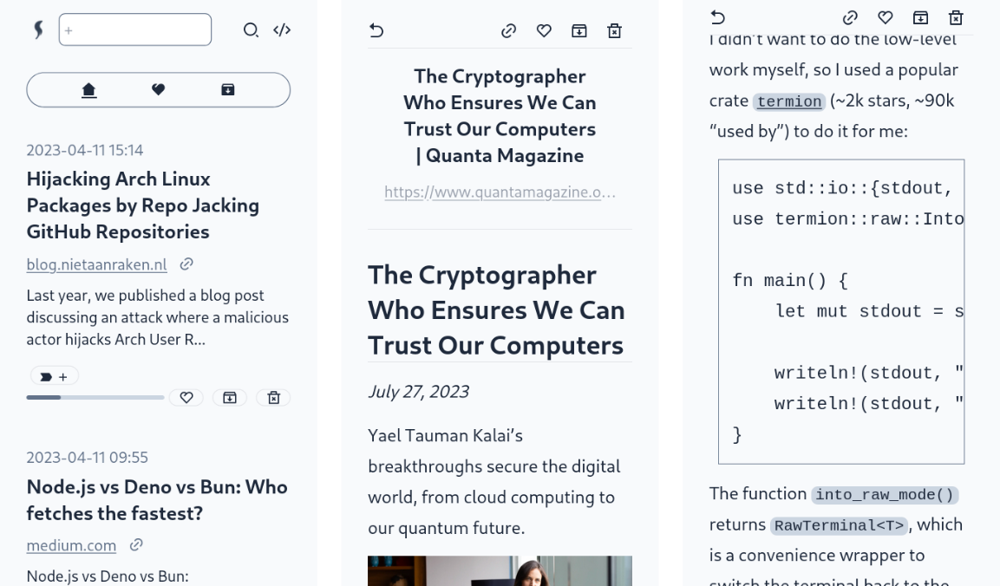
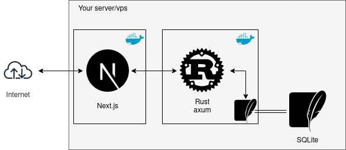

<h1>leaf</h1>

Self-hostable "read-it-later" Web app.

<hr />



<hr />

## What is this exactly

- Save a web page by URL and read its content later.
- Save your progress automatically.
- Features:
  - like
  - archive
  - tagging
  - full-text search (works only with languages based on the Latin script for
    now)
- With the
  [Firefox extension](https://addons.mozilla.org/en-US/firefox/addon/leaf-extension/),
  you can easily add new articles.

## New release

### v0.6.1 (2023-08-06)
- Use light colorscheme.
- Fix title.
- Remove unused env variable `NEXT_PUBLIC_TITLE`.

### v0.6.0 (2023-08-06)
- Scrape contents on the client side: This improves the accuracy of the content, using mozilla/readability.
- Add animation (fade-out) when archiving/deleting articles.

## Deploy

1. Prepare 2 files and 1 empty directory: `docker-compose.yml`, `.env.production` and `databases`.  
`databases` directory will have `.search` directory and `.sqlite` database, which will be automatically created.

`docker-compose.yml` example
```
version: "3"
services:
  server:
    image: docker.io/kyoheiudev/leaf-server:0.6.1
    container_name: leaf-server
    volumes:
      - /path/to/databases:/var/leaf/databases
      - /etc/localtime:/etc/localtime:ro
    ports:
      - 8000:8000
  client:
    image: docker.io/kyoheiudev/leaf-client:0.6.1
    container_name: leaf-client
    volumes:
      - /path/to/.env.production:/app/.env.production
    ports:
      - 3000:3000
```

`.env.production` example
```
NEXT_PUBLIC_HOST=leaf-server
LEAF_API_TOKEN=WHICH_YOU_USE_WHEN_POST_NEW_ONE_VIA_EXTENSION
```

You should edit `LEAF_API_TOKEN`.

By default this app is not protected by any means so that you can use your own auth process.

2. `docker compose up -d` and the app will start listening on port 3000.

## API   
Via API you can add new article:

```http
POST /api/create
Content-Type: application/json
Authorization: LEAF_API_TOKEN

{
  "url": "https://example.com"
}
```

## Architecture



### Tech stack

- TypeScript as the frontend
  - Next.js
  - puppeteer to get contents
  - mozilla/readability
  - tailwindcss
- Rust as the backend
  - axum
  - ammonia as the sanitizer
  - tantivy as the full-text search engine
- SQLite as the database

## Dev

### dev-prerequisites

- docker
- nodejs, cargo, make

Add `.env.development.local` to the `client` directory with the following:

```
NEXT_PUBLIC_HOST=127.0.0.1
LEAF_API_TOKEN=test
```

And in the root directory:

```
cd client && npm install
cd .. && make -i dev
```

Then you can see the page on `localhost:3000`.

## Report bug / Request features / Contribute
This repository is maintained on [https://git.sr.ht/~kyoheiu/leaf](https://git.sr.ht/~kyoheiu/leaf).
Contact me via email: ~kyoheiu/leaf@lists.sr.ht

## TODO

- Rewrite backend in Node.js?
- Import?
